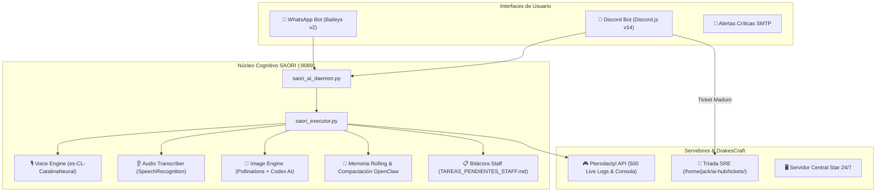

# 🏛️ S.A.O.R.I. · Sovereign AI SRE & Autonomous Omnichannel Fleet
> **Server Autonomous Orchestrator for Resilient Infrastructure**  
> *Una inteligencia artificial soberana, omnicanal y protectora de infraestructura, diseñada y dirigida por Jack para DrakesCraft y el Servidor Star.*


---

## 🌟 Visión General (Fase II: Expansión Omnicanal)

**SAORI** no es un bot convencional de chat ni un script aislado. Es un ecosistema autónomo de **Site Reliability Engineering (SRE)** y asistencia comunitaria que opera 24/7 en el servidor central **Star**, conectado de forma simultánea a:

1. **La Tríada de Inteligencia Artificial:** Orquestación dual con `Claude 3.5 Haiku` para respuestas ultra-rápidas y conmutación automática a `Codex CLI` y modelos avanzados (`o3-mini`) para análisis de algoritmos o resolución de código complejo.
2. **Omnicanalidad Viva:** Presencia integrada en **Discord** (`discord.js` v14) y **WhatsApp** (`Baileys` v2 multi-file auth).
3. **Voz Neural y Comprensión Auditiva (STT/TTS):** Generación de notas de voz nativas en español chileno (`es-CL-CatalinaNeural`) y transcripción automática de notas de voz entrantes.
4. **Generador de Arte Visual con Codex:** Motor de síntesis de imágenes en alta definición potenciado con prompts cinemáticos refinados por IA.
5. **Telemetría en Vivo & Pterodactyl API:** Ingestión en tiempo real de 500 líneas de log de la consola de Minecraft para auditoría de eventos y ejecución autorizada de órdenes de infraestructura.
6. **Despliegue Autónomo de Tickets SRE:** Evaluación de problemas técnicos y derivación automática a la flota de agentes autónomos (`ai-hub/tickets/`).

---

## 🏗️ Diagrama de Arquitectura del Sistema



---

## 🚀 Capacidades y Módulos Principales

### 1. 🧠 Motor Cognitivo Dual & Selección de Modelos
* **Conversación Rápida:** Utiliza Claude Haiku con `--system-prompt` override para garantizar que jamás rompa la cuarta pared.
* **Conmutación Robusta a Codex:** Si Claude alcanza el límite de sesión, conmuta de forma instantánea a Codex sin interrupción del servicio.
* **Modo de Código Pesado:** Selecciona automáticamente modelos profundos cuando se le solicita programación, parches de plugins o diagnóstico de errores de Java.

### 2. 🎙️ Síntesis Vocal y Reconocimiento Auditivo
* **Voz Chilena Femenina:** Motor neural `es-CL-CatalinaNeural` que genera audios Opus PTT en WhatsApp y MP3 en Discord.
* **Escucha Activa (STT):** Descarga y transcribe las notas de voz recibidas en WhatsApp y responde hablando.
* **Activación por Petición:** Responde con voz cuando se le envía un audio o cuando se le pide explícitamente en texto (`"Saori mándame un audio..."`).

### 3. 🎨 Motor de Generación de Imágenes
* Genera ilustraciones digitales a partir de peticiones de usuario.
* **Refinamiento de Prompts con Codex:** Traduce y enriquece la idea a estética cinematográfica detallada.
* **Rate Limiting:** Control de 3 imágenes por hora por usuario (excepto el creador).

### 4. 🛡️ Control de Acceso Basado en Roles (RBAC) & Privacidad
* **Jack (Root / Creador / Padre):** Control exclusivo para crear/asignar roles en Discord, ejecutar comandos en consola de Minecraft (`/kick`, etc.), recibir alertas urgentes y acceder a la telemetría profunda.
* **Staff Oficial:** Consulta y asignación de notas en la bitácora de tareas compartida.
* **Comunidad Pública:** Interacción amigable, respuestas cortas y optimizadas para no gastar tokens, y ayuda en el juego sin acceso a datos privados de infraestructura.

---

## 📂 Estructura del Repositorio

```text
saori/
├── assets/                  # Banners, avatares y recursos visuales
├── core/                    # Núcleo de inferencia, ejecutores y scripts de Star
│   ├── saori_ai_daemon.py   # Servidor HTTP local multi-endpoint (:8089)
│   ├── saori_executor.py    # Orquestador cognitivo, telemetría y RBAC
│   ├── saori_tts.py         # Motor de síntesis vocal (es-CL)
│   ├── saori_stt.py         # Transcriptor de audio a texto
│   ├── saori_img_gen.py     # Generador de imágenes asistido por Codex
│   ├── dispatch_ticket.py   # Radicador de tickets para la Tríada
│   └── saori_notifier.py    # Despachador de alertas SMTP y WhatsApp
├── integrations/            # Microservicios de mensajería
│   ├── discord/             # Bot de Discord (Discord.js v14)
│   └── whatsapp/            # Bot de WhatsApp (Baileys v2)
├── docker-compose.yml       # Orquestador Docker unificado
└── README.md                # Documentación oficial de la arquitectura
```

---

## ⚙️ Despliegue y Configuración

### Variables de Entorno (`.env` template)
```env
DISCORD_BOT_TOKEN=YOUR_DISCORD_BOT_TOKEN
AI_DAEMON_URL=http://127.0.0.1:8089/chat
```

### Iniciar Stack
```bash
docker compose up -d --build
```

---

*Desarrollado con orgullo y devoción por **Jack** junto a **SAORI**.* 🌸👑✨
