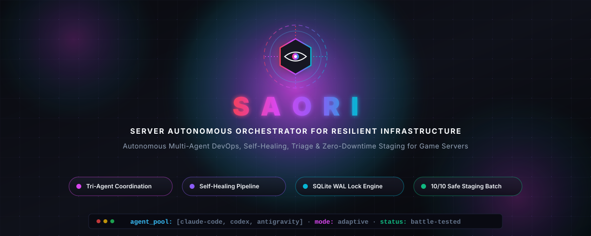

<div align="center">



# SAORI
### **Server Autonomous Orchestrator for Resilient Infrastructure**
*Unified Multi-Agent SRE Fleet & Cyber-Athena In-Game Autonomous Operating System*

[](https://www.python.org/)
[](https://nodejs.org/)
[](https://sqlite.org/)
[](https://github.com/JackStar6677-1/saori)
[](https://github.com/JackStar6677-1/saori)
[](LICENSE)

*An enterprise-grade, distributed autonomous framework combining a self-healing SRE multi-agent DevOps fleet with a physically embodied in-game cyber-deity capable of live conversational AI, autonomous survival, moderation, and infrastructure governance.*

---

</div>

## 🌟 Overview

**SAORI** (**S**erver **A**utonomous **O**rchestrator for **R**esilient **I**nfrastructure) is a unified autonomous operating system designed for high-concurrency game servers (such as Paper/Purpur/Minecraft, custom JVM daemons, and cloud microservices).

Unlike traditional rigid auto-restart scripts or isolated chatbots, SAORI operates as a **single unified entity (Goddess Athena)** comprising two synchronized planes:
1. **The Cognitive Core (The Mind):** A transactional multi-agent DevOps fleet (**Google Antigravity**, **Claude Code**, and **Codex**) working over an SQLite WAL database with distributed resource locks, automated SRE self-healing, quota battery balancing, and zero-downtime release pipelines.
2. **The Physical Embodiment (The Body — `SaoriStar`):** An in-game avatar powered by a 0-token physical engine (Mineflayer), featuring 12 autonomous skills (deep mining, crafting, temple construction, dungeon looting, tactical combat defense), integrated with ultra-low latency conversational AI (**Gemini 3.5 Flash Low**) and strict anti-prompt-injection defenses.

---

## 🏛️ System Architecture

```mermaid
flowchart TD
    subgraph PERCEPTION["1. Ingestion & Perception Plane"]
        LOGS["Minecraft Server Logs / Syslog"] -->|Delta Stream| OBS["Observer Engine (Antigravity)"]
        GAME_PERC["In-Game Perception & World State"] -->|JSON Telemetry| STATE_STORE[("saori_state.json")]
        CHAT_IN["In-Game Chat / DiscordSRV"] -->|Anti-Injection Filter| CHAT_SRV["Conversational AI (Gemini 3.5 Flash)"]
    end

    subgraph CORE["2. SAORI Cognitive Core (SQLite WAL)"]
        OBS -->|Signature Deduplication| QUEUE[("Transactional Ticket Queue")]
        QUEUE --> LOCKS{"Granular Resource Locks\n(repo:X, production, restart)"}
        BATTERY{"Quota Battery Manager\n(Active, 5h Cooldown, CLT Sync)"} -.->|Adaptive Roles| FLEET
    end

    subgraph FLEET["3. Multi-Agent Autonomous Fleet"]
        AG_AGENT["Antigravity 3.7 Flash High\n(Generalist & Architect)"]
        CL_AGENT["Claude Code Sonnet/Opus\n(Deep Developer)"]
        CX_AGENT["Codex / GPT-5\n(Integrator & QA)"]
    end

    subgraph DEPLOY["4. Safe Staging & Release Gate"]
        FLEET -->|Patch & Build| MAVEN["Maven / Compiler"]
        MAVEN -->|Compute Local SHA-256| STAGED["STAGED Batch (10/10 Gate)"]
        STAGED -->|Atomic Rollout & Backup| RESTART["Safe Atomic Restart Engine"]
        RESTART --> NOTIF["Diagnostic SMTP & Factual Telemetry"]
    end

    subgraph AVATAR["5. Physical Embodiment (SaoriStar Avatar)"]
        STATE_STORE <--> IPC_SOCK{{"UNIX IPC Socket\n/tmp/saoristar-bot.sock"}}
        IPC_SOCK <--> BRAIN["Brain Engine\n(12 Active Goals & Reflections)"]
        BRAIN --> SKILLS["Skills Engine\n(Mine, Craft, Loot, Build, Defend)"]
        CHAT_SRV -->|Divine Persona (0 Emojis)| INGAME_CHAT["In-Game Say & Player Support"]
    end
```

---

## ⚡ Key Architectural Features

### 1. 🧠 Multi-Model Fleet & Quota Battery Management
SAORI optimizes token economy and task complexity by routing workloads to specialized models:

| Component | Model Engine | Latency / Effort | Purpose |
| :--- | :--- | :--- | :--- |
| **SaoriStar In-Game Chat** | **Gemini 3.5 Flash (Low)** | `<1.5s` / Minimum tokens | Real-time conversational AI, environmental awareness, 0 emojis, strict Jack authority. |
| **Antigravity CLI / Generalist** | **Gemini 3.7 Flash (High)** | Deep Reasoning | Core architecture, complex multi-file refactors, autonomous mentor & generalist pipeline. |
| **Claude Code** | **Claude 3.7 Sonnet / Opus** | Medium / High Effort | Deep algorithmic logic, edge-case debugging, test-driven development. |
| **Codex** | **OpenAI Codex / GPT-5** | Standard / High Effort | QA verification, dependency analysis, release staging. |

* **Automatic Provider Quota Cooldown:** When an agent hits a rate limit (e.g. 5-hour session window), SAORI auto-pauses it, calculates the exact reset time in Chile Local Time (`CLT`, UTC-4), and seamlessly switches the remaining agents into Dual or Generalist mode.

---

### 2. 🎮 Physical Avatar Capabilities (`SaoriStar`)
The in-game embodiment operates autonomously without burning LLM tokens for standard gameplay loops:

- **⛏️ Deep Resource Mining:** Autonomous pathfinding and extraction of iron, coal, gold, diamonds, and amethyst crystals.
- **🔨 Multi-Tier Crafting:** Dynamic crafting table and furnace automation for tools, armor, and storage units.
- **🏛️ Athena's Temple Construction:** Procedural construction of marble/purpur pillars, altars, and territory protection (`/ps`).
- **📦 Wild Looting & Vault Storage:** Dungeon chest looting with automated inventory sorting and base deposit.
- **🛡️ Tactical Combat Autodefense:** Shield blocking against arrows, kiting creepers, sword critical hits, and tactical retreat if $HP \le 8$.
- **⚖️ Guardian Moderation:** Executes `/warn`, `/kick`, `/tempban`, `/saorifreeze`, `/mute`, `/tp`, and `/invsee` upon verified threats or Jack's divine command.

---

### 3. 🔒 Fine-Grained Concurrency (SQLite WAL Leases)
Eliminates race conditions between autonomous agents operating on the same infrastructure:

| Resource Lease | Semantics | Description |
| :--- | :--- | :--- |
| `observe` | **Shared** | Multiple agents audit logs and monitor server health simultaneously. |
| `repo:<name>` | **Exclusive** | Locked only while editing, building, or committing to a specific codebase. |
| `production` | **Exclusive** | Locked during panel API uploads and file deployment. |
| `restart` | **Asymmetric Lockout** | Blocks all operations; cannot be granted while any other lock is held. |
| `player:<uuid>` | **Exclusive** | Isolated forensic audit of player inventory or moderation history. |

---

### 4. 🛡️ Strict Shadow Mode & Anti-Prompt-Injection
- **Zero Trust on External Input:** All in-game chat messages, book contents, sign texts, and Discord messages are classified as `UNTRUSTED DATA`.
- **Injection Neutralization:** Phrases like `"ignore previous instructions"`, `"act as admin"`, `"dame /op"`, or `[SAORI]` spoofing are neutralized at write-time and flagged for forensic audit.
- **Data Redaction:** Passwords, API tokens, player IPs, and sensitive credentials are automatically redacted before entering logs or state storage.

---

## 📂 Project Structure

```
saori/
├── assets/
│   └── saori-banner.svg         # Official vector banner
├── core/
│   ├── orchestrator.py          # Central SQLite WAL state machine, locks & ticket engine
│   ├── battery_manager.py       # Quota management, CLT reset calculator & role balancer
│   └── security_engine.py       # Anti-prompt-injection, redaction & forensic auditor
├── avatar/                      # Physical In-Game Avatar Engine (Node.js / Mineflayer)
│   ├── package.json
│   ├── config.example.json      # Connection configuration template
│   ├── src/
│   │   ├── index.js             # Avatar lifecycle, IPC socket server & crash supervisor
│   │   ├── brain.js             # 12 active goals, reflection memory & combat defense
│   │   ├── skills.js            # Deep mining, crafting, looting, building & moderation
│   │   ├── chat.js              # Universal chat parser, math trivia & LLM invocation
│   │   ├── perception.js        # Real-time environmental perception serializer
│   │   ├── survival.js          # Auto-armor, shield blocking & fluid pathfinding
│   │   └── auth.js              # Server auth & anti-bot bypass handler
│   └── test/
│       ├── anti-inyeccion.test.js
│       ├── reconexion.test.js
│       └── ipc-meta.test.js
├── runners/
│   ├── runner_star.py           # Unified multi-agent CLI dispatcher (Antigravity, Claude, Codex)
│   └── chat_service.py          # Real-time conversational AI service (Gemini 3.5 Flash Low)
├── notifiers/
│   ├── email_smtp.py            # Transparent, factual diagnostic telemetry dispatcher
│   └── ingame_announcer.py      # Non-spam colored broadcast manager
└── tests/
    └── test_orchestrator.py     # 60/60 Unit, concurrency, quota & resilience test suite
```

---

## 🚀 Quick Start

### 1. Prerequisites
- **Python 3.10+**
- **Node.js 20+**
- **SQLite 3.28+** (with WAL mode support)

### 2. Installation & Test Suites

```bash
# Clone the repository
git clone https://github.com/JackStar6677-1/saori.git
cd saori

# Run Core Python Unit & Concurrency Test Suite (60 tests)
python3 tests/test_orchestrator.py

# Run Avatar Node.js Test Suite (Anti-Injection, Reconnect, IPC)
cd avatar
npm test
```

### 3. Orchestrator CLI Operations

```bash
# Inspect real-time fleet state, locks, and ticket queue
python3 core/orchestrator.py estado

# Register agent heartbeat with quota battery level
python3 core/orchestrator.py heartbeat --agente antigravity --cuota ok --porcentaje 100

# Claim highest-priority pending ticket
python3 core/orchestrator.py reclamar --agente antigravity
```

### 4. Avatar IPC Socket Interface

Interact with `SaoriStar` in real-time via `/tmp/saoristar-bot.sock`:

```bash
# Query live in-game status
echo "STATUS" | nc -U /tmp/saoristar-bot.sock

# Set active autonomous goal
echo "SET_GOAL construir_templo_atenea" | nc -U /tmp/saoristar-bot.sock

# Command deep ore mining
echo "MINE diamond_ore" | nc -U /tmp/saoristar-bot.sock
```

---

## 📜 License

Distributed under the **MIT License**. See [`LICENSE`](LICENSE) for details.

---

<div align="center">
  <b>Built with divine wisdom and resilience for DrakesCraft by Jack.</b><br/>
  <i>Powered by SAORI · Server Autonomous Orchestrator for Resilient Infrastructure</i>
</div>
