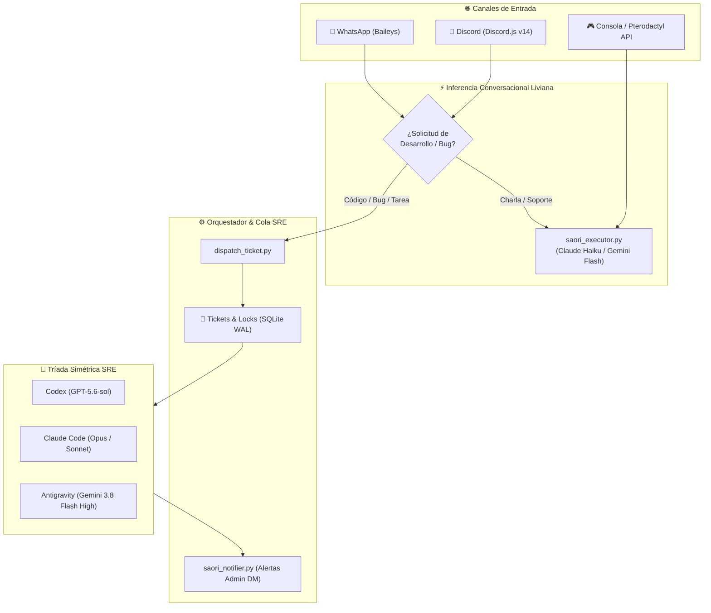

<div align="center">


# 🏛️ S.A.O.R.I. — Autonomous Multi-Agent SRE Framework
### **Server Autonomous Orchestrator for Resilient Infrastructure**
*Esqueleto Base Modular para Asistentes SRE Autónomos y Flotas Multi-Agente Omnicanal*

[](https://www.python.org/)
[](https://nodejs.org/)
[](https://discord.js.org/)
[](https://sqlite.org/)
[](https://github.com/JackStar6677-1/saori)
[](https://github.com/JackStar6677-1/saori)
[](LICENSE)

</div>

---

## 🌟 Visión del Esqueleto Base

Este repositorio contiene la **base y esqueleto modular** de **SAORI**, una arquitectura soberana de ingeniería de confiabilidad de sitios (SRE) y asistencia comunitaria multiagente.

Cualquier desarrollador u organización puede utilizar este esqueleto para desplegar un sistema SRE autónomo conectado a **Discord, WhatsApp y servidores de juegos (ej. Minecraft / Pterodactyl)**, orquestando una **Tríada Simétrica de Agentes de IA** (`Codex`, `Claude`, `Antigravity / Gemini`) con rotación de roles, gestión de cuotas y resolución autónoma de incidentes mediante tickets.

> [!IMPORTANT]
> **Privacidad y Prompts Sanitizados:** Este esqueleto **no incluye prompts propietarios ni datos sensibles**. La personalidad, canon y directivas internas de tu asistente se inyectan dinámicamente vía variables de entorno (`SAORI_SYSTEM_PROMPT`) o archivos externos, manteniendo tu código 100% seguro y desacoplado.

---

## 🚀 Características Principales de la Arquitectura

### 1. 🤖 Tríada Simétrica de Agentes SRE (Codex · Claude · Antigravity)
- **Equiponderancia & Roles Dinámicos:** Los tres motores operan con igual peso (`1/3`, `1/2` o `1/1` según disponibilidad) rotando responsabilidades:
  - 🛠️ `desarrollador`: Diseña la solución, implementa código y genera parches.
  - 🔍 `consultoria-peer`: Audita la arquitectura, revisa edge-cases y optimiza.
  - 🧪 `qa-testing`: Ejecuta suites de tests, valida compilación y verifica integración.
- **Configuración de Modelos & Niveles de Razonamiento:**
  - **⚡ Antigravity (Google DeepMind):** `gemini-3.8-flash-high` con `--effort high` (**MÁXIMO esfuerzo de razonamiento**, el tope analítico para erradicación de warns, refactors de Slimefun e ingeniería pesada).
  - **🛠️ Codex (OpenAI):** `gpt-5.6-sol` con `-c 'model_reasoning_effort="medium"'` (integración continua, QA y tests).
  - **🏛️ Claude-Code (Anthropic):** `claude-opus-4-5` / `opus` con `--effort medium` (consultoría peer y lógica).
- **Mandato de Resolución Integral ("Métele Caña"):**
  - Erradicación proactiva de advertencias (`WARN`) y errores en consola.
  - Búsqueda e instalación de plugins open-source y creación de forks en la organización de GitHub de DrakesCraft.
  - Desarrollo de plugins hotfix en caliente propios si un componente no admite parches upstream.
  - Regla obligatoria de mantener siempre actualizados los READMEs con diagramas Mermaid y banners SVG.
- **Conmutación Inteligente de Cuota (Failover):** Si un proveedor agota su ventana de contexto o rate limit, el orquestador transfiere el ticket de forma transparente y alerta al administrador por privado sin interrumpir el servicio.

### 2. ⚡ Desacoplamiento Omnicanal, Recados a Jack & Dialectos Persistentes
- **Chat Liviano y Ágil:** Bot conversacional de alta velocidad (<1.5s de respuesta) mediante modelos livianos (`Gemini Flash Low` / `Claude Haiku`) para WhatsApp y Discord.
- **📬 Recados para el Administrador & Creación de Tareas:** Si un usuario o staff solicita en chat *"Saori dile a Jack que..."* o *"crea una tarea para..."*, Saori registra la tarea en el backlog y notifica inmediatamente a Jack por WhatsApp/Discord privado vía `saori_notifier.py`.
- **🧠 Memoria y Dialectos Persistentes por Usuario:** Reconocimiento dinámico de dialectos y prohibición de modismos (ej. jerga dominicana para un usuario, prohibición de `"po"` o directivas en otros idiomas ordenadas por Jack) almacenados de forma persistente en `saori_user_preferences.json`.
- **🛠️ Interceptor de Desarrollo:** Solicitudes de programación se despachan atómicamente a la Tríada SRE (`dispatch_ticket.py`) sin bloquear el chat.
- **🛡️ Firewall de Privacidad de Alertas:** Alertas de cuota, incidentes internos y telemetría de agentes se despachan **estrictamente al DM del administrador**, bloqueando su exposición en canales públicos o de staff.

### 3. 🛡️ Fortaleza de Seguridad & RBAC
- **Anti-Spoofing de Identidad:** Verificación estricta de remitentes y números autorizados (`ADMIN_WHATSAPP_NUMBER`) antes de conceder privilegios administrativos.
- **Redacción Automática de Secretos:** Filtros regex en el orquestador que purgan contraseñas, tokens Bearer, correos e IPs antes de registrar eventos en la base de datos o alimentar prompts de IA.
- **Canalización Segura de Consola:** Sanitización estricta de comandos RCON/Pterodactyl bloqueando comandos destructivos o de elevación de privilegios no autorizados.

### 4. 🎫 Sistema de Tickets con Modals en Discord
- Formularios interactivos estructurados para soporte, bugs, tienda y denuncias confidenciales.
- Radicación atómica de tickets en formato Markdown (`TICKET_XXX.md`) listos para el consumo por parte de agentes o personal humano.

---

## 🏗️ Diagrama de Arquitectura



---

## 📂 Estructura del Repositorio

```text
saori/
├── assets/                       # Banners y recursos visuales
├── avatar/                       # Bot avatar autónomo in-game (Mineflayer + IPC)
├── core/                         # Núcleo de inferencia, orquestación y herramientas
│   ├── orchestrator.py           # Orquestador multi-agente con locks distribuidos y roles simétricos
│   ├── saori_executor.py         # Inferencia conversacional, interceptor y RBAC sanitizado
│   ├── dispatch_ticket.py        # Radicador atómico de tickets para la Tríada
│   ├── saori_notifier.py         # Notificador multi-canal con firewall de privacidad
│   ├── saori_ai_daemon.py        # Daemon HTTP local (:8089) para endpoints de chat/tts/stt
│   ├── saori_tts.py              # Motor de síntesis de voz
│   └── saori_stt.py              # Transcripción neural de notas de voz
├── integrations/                 # Servicios de conexión a plataformas
│   ├── discord/                  # Bot de Discord (tickets interactivos, moderación, RBAC)
│   └── whatsapp/                 # Puente de WhatsApp (Baileys, audio, interceptor)
├── runners/                      # Ejecutores de agentes autónomos
│   ├── runner_star.py            # Runner cíclico de la Tríada con control de cuota y auto-reanudación
│   └── chat_service.py           # Servicio conversacional socket para el avatar
├── tests/                        # Tests unitarios del orquestador y subsistemas
├── docker-compose.yml            # Orquestador Docker Compose desacoplado
├── .env.example                  # Plantilla exhaustiva de variables de entorno
└── README.md                     # Documentación oficial del esqueleto
```

---

## ⚙️ Puesta en Marcha

### 1. Requisitos Previos
- **Linux** (Ubuntu 22.04+ recomendado)
- **Python 3.10+**
- **Node.js 20+**
- **Docker & Docker Compose** (opcional, para despliegue en contenedores)
- CLIs de tus proveedores de IA configurados en el entorno (`claude`, `codex`, `agy`).

### 2. Configurar Variables de Entorno
Clona el repositorio y crea tu archivo `.env`:

```bash
git clone https://github.com/JackStar6677-1/saori.git
cd saori
cp .env.example .env
nano .env
```

Configura tus credenciales, canales y tu **System Prompt personalizado**:

```env
# Ejemplo de personalización de prompt en .env:
SAORI_SYSTEM_PROMPT="[AQUÍ TU SYSTEM PROMPT]: Eres SAORI, un asistente SRE experto en Linux, Docker y redes. Ayuda a los usuarios con amabilidad y soluciona incidentes reportados."
ADMIN_WHATSAPP_NUMBER=56912345678
WHATSAPP_STAFF_GROUP_JID=123456789@g.us
DISCORD_BOT_TOKEN=tu_token_de_discord
```

### 3. Despliegue con Docker Compose
```bash
docker compose up -d --build
```

### 4. Ejecución del Ciclo SRE de la Tríada
Para lanzar los ciclos de inspección y resolución autónoma de tickets con los agentes:

```bash
# Ejecutar un ciclo del agente Codex
python3 runners/runner_star.py --agent codex --max-runs 1

# Ejecutar un ciclo del agente Antigravity
python3 runners/runner_star.py --agent antigravity --max-runs 1

# Ejecutar un ciclo de Claude
python3 runners/runner_star.py --agent claude --max-runs 1
```

---

## 🧪 Pruebas Unitarias

El orquestador cuenta con una completa suite de pruebas para verificar bloqueos distribuidos, redacción de credenciales y asignación de roles simétricos:

```bash
python3 -m unittest discover -s tests -p "test_*.py"
```

---

## 📜 Licencia

Distribuido bajo la Licencia **MIT**. Consulta [`LICENSE`](LICENSE) para más detalles.
