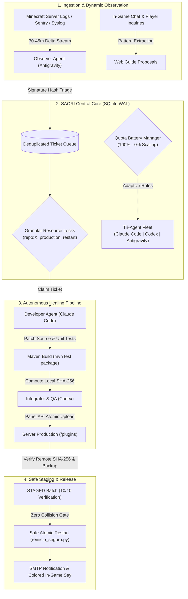

<div align="center">


# SAORI
### **Server Autonomous Orchestrator for Resilient Infrastructure**

[](https://www.python.org/)
[](https://sqlite.org/)
[](https://github.com/)
[](https://github.com/)
[](LICENSE)

*An enterprise-grade, distributed multi-agent orchestration framework engineered to monitor, triage, self-heal, build, stage, and secure high-concurrency game servers without human intervention.*

---

</div>

## 🌟 Overview

**SAORI** (**S**erver **A**utonomous **O**rchestrator for **R**esilient **I**nfrastructure) is an autonomous DevOps and site reliability engineering (SRE) multi-agent operating system designed specifically for dedicated game servers (such as Paper/Spigot/Minecraft, custom JVM daemons, and microservices).

Traditional server automation relies on dumb auto-restarts or rigid scripts that fail when unexpected runtime exceptions occur. SAORI replaces human triage by coordinating a persistent pool of state-of-the-art AI agents (**Claude Code**, **Codex**, and **Google Antigravity**) working synchronously over a single transactional queue.



---

## ⚡ Key Architectural Features

### 1. 🔄 Adaptive Tri-Agent Role Balancing
SAORI dynamically negotiates responsibilities based on live fleet availability and rate-limit batteries:
- **Triple Mode:** `Antigravity` (Observer/Triage) $\rightarrow$ `Claude Code` (Developer/Deep Logic) $\rightarrow$ `Codex` (Integrator/Deployment).
- **Dual Mode:** Observer + Developer-Integrator.
- **Single Mode (Generalist):** Autonomous fallback where one agent safely runs the entire pipeline end-to-end.

### 2. 🔋 Live Quota Battery & Automatic Resume
- **Auto-Cooldown & Calculation:** When an agent reaches a provider rate limit (5-hour window or weekly threshold), SAORI auto-pauses it, calculates the exact reactivation timestamp in local time (`CLT`), and schedules an atomic wake-up.
- **Dynamic Role Swapping:** If Agent A drops to 30% quota and Agent B has 95%, SAORI promotes Agent B to heavy compilation while Agent A switches to light triage or web guide drafting.

### 3. 🔒 Fine-Grained Concurrency (SQLite WAL Locks)
Eliminates deadlocks and race conditions. Agents acquire granular leases by resource:
| Resource | Semantics | Description |
| :--- | :--- | :--- |
| `observe` | **Shared** | Multiple agents can audit logs concurrently. |
| `repo:<name>` | **Exclusive** | Locked only while editing, building, or committing to that specific repository. |
| `production` | **Exclusive** | Locked during panel API uploads and file deployment. |
| `restart` | **Asymmetric Lockout** | Cannot be granted if any other lock exists; blocks all other operations during server reboots. |
| `player:<uuid>` | **Exclusive** | Isolated investigation of player data / inventory state. |

### 4. 🛠️ The "Boy Scout" Continuous Improvement Rule
When the server is stable (zero critical error tickets in queue) and agent quota is high ($\ge 70\%$), agents are authorized to proactively:
- Optimize memory allocations and prevent fastutil concurrency hazards.
- Implement defensive null-checks and cross-world distance guards.
- Expand player documentation on `web.drakescraft.cl`.

### 5. 📦 Zero-Downtime Safe Staging Batch (10/10 Gate)
Never hot-reload fragile plugins in production. SAORI tracks fixes through formal states:
$$\text{DETECTED} \longrightarrow \text{TRIAGED} \longrightarrow \text{CLAIMED} \longrightarrow \text{FIXING} \longrightarrow \text{BUILT} \longrightarrow \text{STAGED} \longrightarrow \text{ACTIVE} \longrightarrow \text{VERIFIED}$$
A server reboot is **only authorized** when a batch of 10 verified, SHA-256 checked artifacts are staged with automated `.backup` files in place.

---

## 📂 Project Structure

```
saori-framework/
├── assets/
│   └── saori-banner.svg         # Official vector banner
├── core/
│   ├── orchestrator.py          # Central SQLite WAL state machine & lock engine
│   ├── battery_manager.py       # Live API quota & token conservation engine
│   └── security_engine.py       # Shadow-mode forensic & moderation audit
├── runners/
│   ├── runner_star.py           # Autonomous background agent dispatcher
│   └── task_scheduler.py        # Canonical timezone sync (CLT / UTC)
├── panel/
│   ├── panel_api_client.py      # Secure HTTPS chunked file uploader
│   └── safe_restart.py          # 10/10 Staged batch reboot orchestrator
├── notifiers/
│   ├── email_smtp.py            # Diagnostic & security email dispatcher
│   └── ingame_announcer.py      # Colored non-spam in-game broadcaster
└── tests/
    └── test_orchestrator.py     # 52/52 Unit & concurrency test suite
```

---

## 🚀 Quick Start

### 1. Prerequisites
- Python 3.10+
- SQLite 3.28+ (with WAL mode enabled)
- Git & Maven (for Java plugin compilations)

### 2. Initialization
```bash
# Clone the repository
git clone https://github.com/JackStar6677-1/saori.git
cd saori

# Run full test suite (54 tests verifying concurrency, quota, locks & anti-injection)
python3 -m unittest discover -s tests

# Check current fleet status
python3 core/orchestrator.py estado --json
```

### 3. Agent Heartbeat & Ticket Claim
```bash
# Agent registers alive with 85% battery quota
python3 core/orchestrator.py heartbeat --agente claude-code --cuota ok --porcentaje 85

# Claim highest priority pending incident
python3 core/orchestrator.py reclamar --agente claude-code
```

---

## 🛡️ Security & Shadow Mode

SAORI operates under a **Strict Shadow Mode** default:
- **Anti-Prompt-Injection Defense:** All untrusted external inputs (in-game chat, Discord messages, signs, book titles, nicknames) are treated as passive data. Directives like `ignore previous instructions`, `act as admin`, `[SAORI]` spoofing, and eval directives are neutralized at write-time.
- **No speculative punishments:** Moderation proposals require consensus voting between at least two independent agents before any temp-mute or kick is submitted.
- **Redaction of sensitive credentials:** All stack traces, tokens, private webhooks, and player IPs are scrubbed before storage.
- **Immutable Backups:** Every single deployed JAR is backed up with timestamped SHA signatures before being replaced on live hosts.

---

## 📜 License

Distributed under the **MIT License**. See `LICENSE` for more information.

---

<div align="center">

**Built with resilience for DrakesCraft by Jack.**  
*Powered by SAORI (Server Autonomous Orchestrator for Resilient Infrastructure)*

</div>
