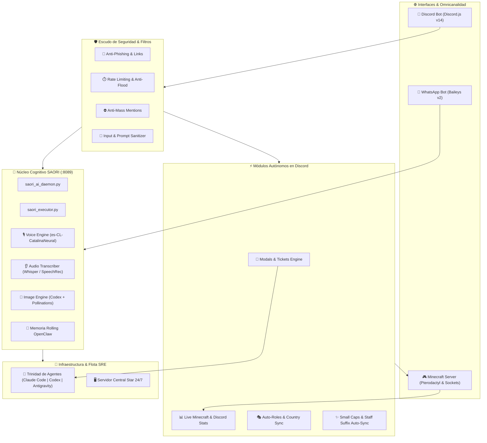

<div align="center">


# 🏛️ S.A.O.R.I. — v4.0 (Autonomous OS & Fortress)
### **Server Autonomous Orchestrator for Resilient Infrastructure**
*Unified Multi-Agent SRE Fleet · Cyber-Athena Autonomous Operating System*

[](https://www.python.org/)
[](https://nodejs.org/)
[](https://discord.js.org/)
[](https://sqlite.org/)
[](https://github.com/JackStar6677-1/saori)
[](https://github.com/JackStar6677-1/saori)
[](LICENSE)

</div>

---

## 🌟 Visión General & Evolución del Sistema

**SAORI (Server Autonomous Orchestrator for Resilient Infrastructure)** es el sistema operativo autónomo y la entidad de inteligencia artificial central que gobierna, monitorea, protege y da soporte 24/7 a **DrakesCraft Network** desde el servidor de infraestructura **Star**.

A través de su evolución continua, SAORI ha trascendido de ser un bot conversacional a convertirse en una **fortaleza de gobernanza comunitaria, SRE autónomo y plataforma omnicanal** que reemplaza múltiples bots de terceros en una arquitectura unificada y segura.

---

## 🚀 Hoja de Ruta & Versiones Canónicas

### 🔹 v1.0 / v2.0 — Génesis Omnicanal & Núcleo Cognitivo
- **Tríada de IA Cognitiva:** Orquestación dual con `Claude 3.5 Haiku` y conmutación transparente a `Codex CLI` y modelos avanzados (`o3-mini`).
- **Omnicanalidad Viva:** Puentes de comunicación simultánea entre **WhatsApp** (`Baileys` multi-auth) y **Discord** (`discord.js` v14).
- **Voz Neural & Audio (TTS/STT):** Síntesis vocal nativa en español chileno (`es-CL-CatalinaNeural`) y transcripción automática de notas de voz.
- **Arte Visual Asistido por IA:** Generación de ilustraciones en alta resolución con prompts cinematográficos refinados.
- **Telemetría Pterodactyl:** Ingestión en vivo de 500 líneas de log de consola de Minecraft para detección proactiva de anomalías.

### 🔹 v3.0 — Tríada SRE Autónoma & Triaje de Bugs
- **Canal Foro de Bugs (`#🐛・ʀᴇᴘᴏʀᴛᴇ-ᴅᴇ-ʙᴜɢs`):** Triaje automático de reportes de errores de la comunidad con 6 etiquetas oficiales.
- **Despachador de Tickets a Agentes:** Creación de tickets formales (`TICKET-XXX`) en `ai-hub/tickets/` asignados a la Trinidad de Agentes Autónomos (**Claude Code, Codex y Antigravity**) con resolución y auditoría.

### 🔹 v4.0 — Fortaleza de Seguridad, Auto-Gobernanza & Métricas en Vivo *(Versión Actual)*
- **🎫 Sistema de Tickets con Modals Obligatorios:** Eliminación total de mensajes fragmentados (*"hola"*) mediante 6 formularios interactivos estructurados:
  - 🐛 *Bugs y Errores Técnicos*
  - 📦 *Pérdida de Ítems / Rollback*
  - 🛒 *Compras y Tienda Tebex*
  - ❓ *Dudas y Guías Generales*
  - 🛡️ *Postulación Oficial a Staff*
  - ⚖️ *Denuncias Confidenciales Anti-Abuso (Solo visibles para Owner y Alta Administración)*
- **🛡️ Escudo Multi-Capa Anti-Ataques:**
  - *Anti-Phishing & IP Loggers:* Detección y borrado fulminante de enlaces fraudulentos o maliciosos con registro en auditoría.
  - *Anti-Flood & Rate Limiting:* Control de flujo por token-bucket para mensajes, comandos e interacciones.
  - *Anti-Mass Mentions (Anti-Raid):* Bloqueo inmediato de pings masivos no autorizados.
  - *Sanitización de Payloads:* Eliminación de caracteres nulos (`\0`), Zero-Width spaces y mitigación de prompt injections.
  - *Resiliencia Global Anti-Crash:* Captura segura de excepciones no controladas para 99.99% de disponibilidad.
- **✨ Normalizador de Apodos (Small Caps) & Auto-Sufijos de Staff:**
  - Desofuscación y normalización automática de fuentes Unicode raras, góticas o distorsionadas.
  - Estandarización de todos los miembros a la tipografía canónica Small Caps.
  - Asignación dinámica de sufijos de Staff (`- ᴀᴅᴍɪɴ`, `- ᴍᴏᴅ`, `- ʙᴜɪʟᴅᴇʀ`, `- ᴅᴇᴠ`, `- ʜᴇʟᴘᴇʀ`, `- ʙᴜғóɴ`) en tiempo real al cambiar de roles (`guildMemberUpdate`).
- **📊 Módulo de Estadísticas del Servidor en Vivo:**
  - Categoría autónoma sincronizada cada 10 minutos.
  - Ping en tiempo real al socket de Minecraft (`mc.drakescraft.cl`) para mostrar jugadores online reales.
  - Reemplazo total y expulsión de bots de estadísticas de terceros.
- **🎭 Motor de Identidad con 34 Auto-Roles:**
  - Plataformas: `☕ Java` / `📱 Bedrock`.
  - Modalidades: `⚡ Slimefun & Tech`, `🏝️ OneBlock`, `☁️ SkyBlock`, `⚔️ Survival`, `🎯 PvP Arenas`.
  - Notificaciones, Género y **20 Países** extraídos de las métricas reales de procedencia de jugadores en Star.
- **🎵 Suite Completa de Música & Streaming:** Integración nativa de DisTube con Spotify y YouTube para reproducción en salas de voz.

---

## 🏗️ Diagrama de Arquitectura del Sistema (v4.0)



---

## 📂 Estructura del Repositorio

```text
saori/
├── assets/                  # Banners, avatares y recursos visuales oficiales
├── core/                    # Núcleo de inferencia, ejecutores y scripts de Star
│   ├── saori_ai_daemon.py   # Servidor HTTP local multi-endpoint (:8089)
│   ├── saori_executor.py    # Orquestador cognitivo, telemetría y RBAC
│   ├── saori_tts.py         # Motor de síntesis vocal (es-CL-CatalinaNeural)
│   ├── saori_stt.py         # Transcriptor neural de audio a texto
│   ├── saori_img_gen.py     # Generador de imágenes asistido por Codex
│   ├── dispatch_ticket.py   # Radicador de tickets para la Trinidad SRE
│   └── saori_notifier.py    # Despachador de alertas SMTP y WhatsApp
├── integrations/            # Microservicios de mensajería y plataformas
│   ├── discord/             # Bot de Discord (v4.0 Fortress, Tickets & Stats)
│   │   ├── Dockerfile       # Contenedor optimizado de Node.js 20
│   │   ├── package.json     # Dependencias de Discord.js v14, DisTube y plugins
│   │   ├── .env.example     # Plantilla de variables de entorno seguras
│   │   ├── README.md        # Documentación de la integración de Discord
│   │   └── index.js         # Motor principal de Discord (2300+ líneas)
│   └── whatsapp/            # Bot de WhatsApp (Baileys v2)
├── docker-compose.yml       # Orquestador Docker unificado con auto-restart
├── .env.example             # Plantilla global de variables de entorno
└── README.md                # Documentación oficial de la arquitectura v4.0
```

---

## ⚙️ Despliegue Rápido con Docker

### 1. Configurar variables de entorno:
```bash
cp .env.example .env
nano .env
```

### 2. Iniciar el stack completo:
```bash
docker compose up -d --build
```

---

*Desarrollado con dedicación y excelencia para el ecosistema de **DrakesCraft Network** por **Jack** junto a **SAORI**.* 🌸👑✨
